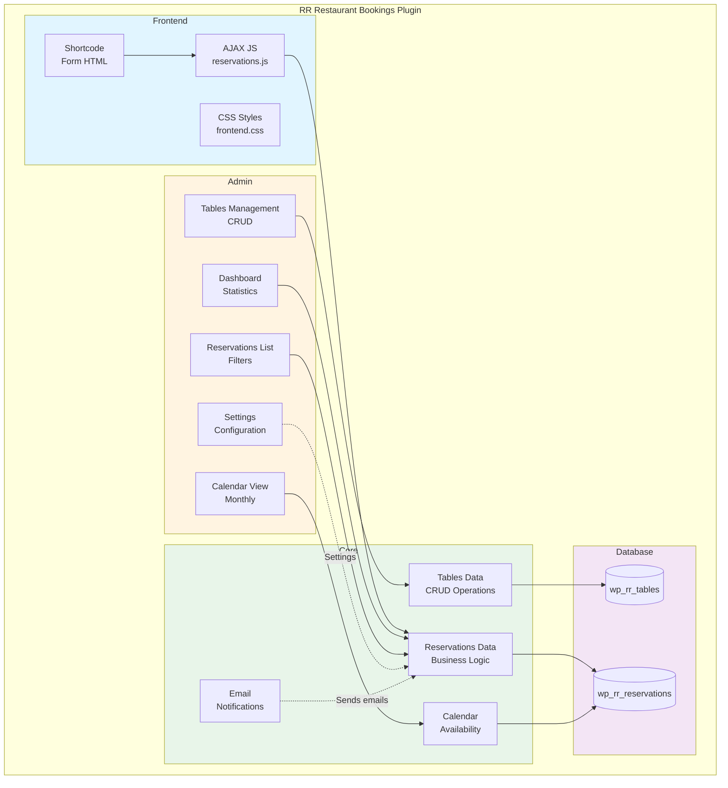
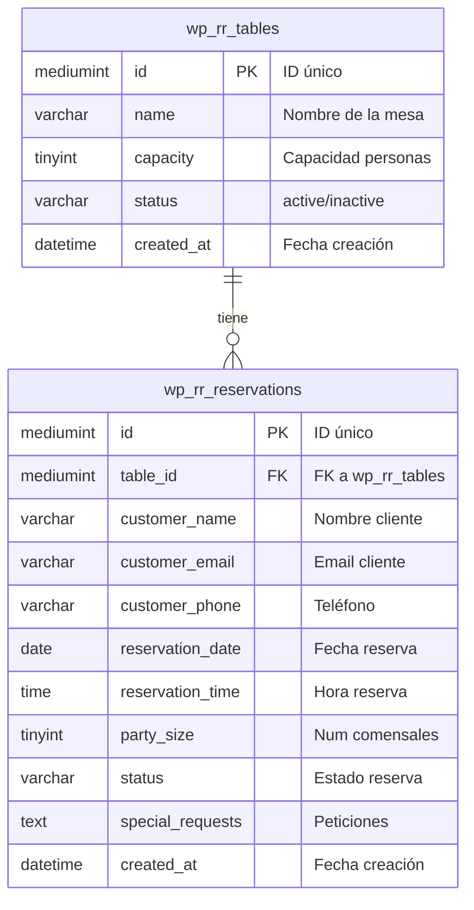
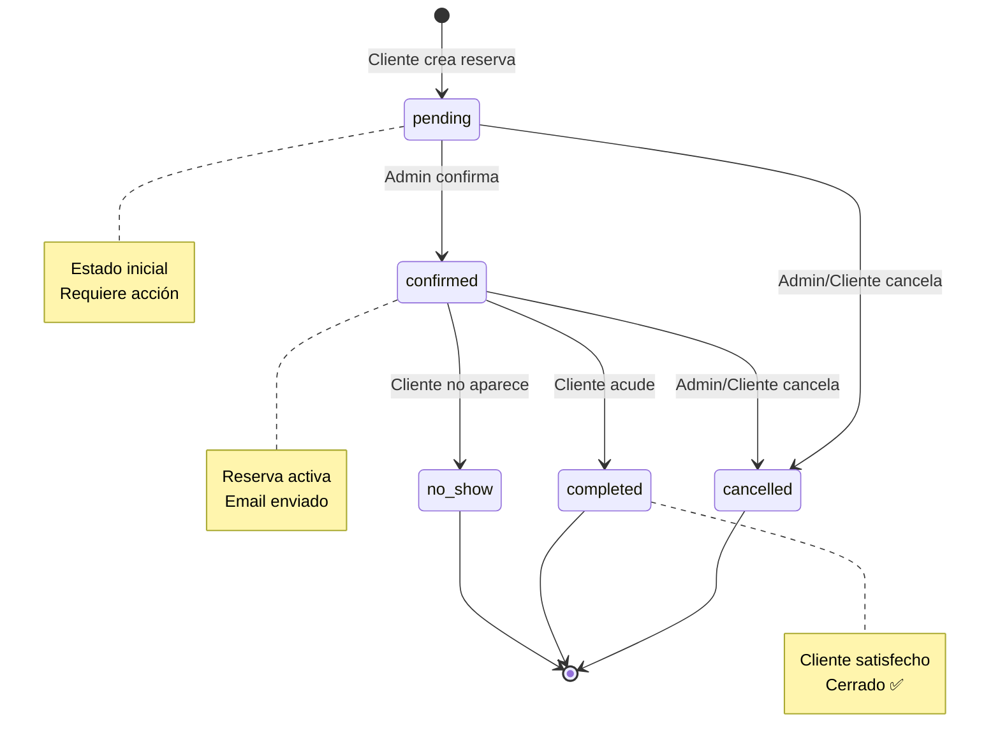
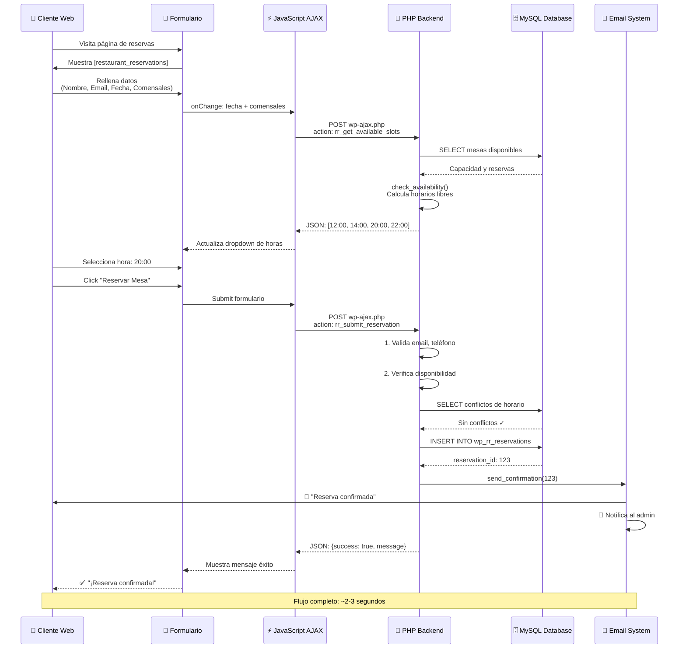
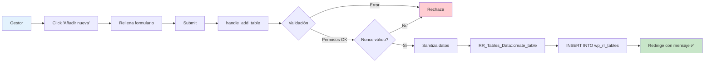
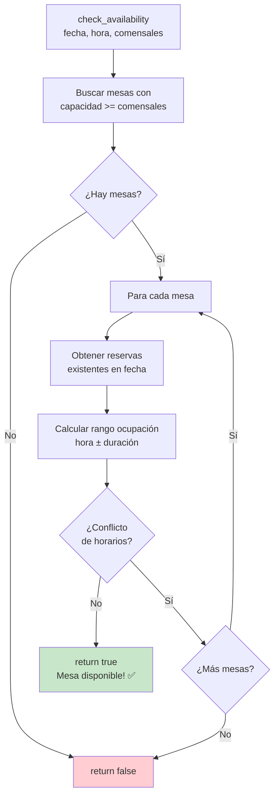
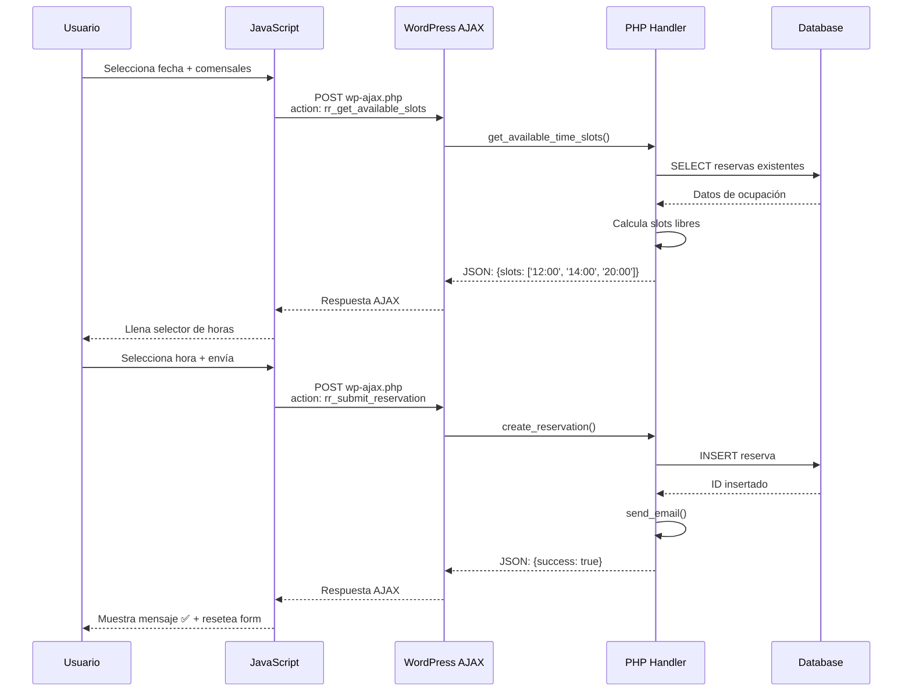

# 🍽️ RR Restaurant Bookings

**Sistema completo de gestión de reservas para restaurantes con calendario, gestión de mesas y notificaciones por email.**

Versión 1.0.1 | Por Development Team

---

## 📋 Tabla de Contenidos

- [Características](#-características)
- [Instalación](#-instalación)
- [Uso Rápido](#-uso-rápido)
- [Arquitectura del Plugin](#-arquitectura-del-plugin)
- [Estructura de Archivos](#-estructura-de-archivos)
- [Base de Datos](#-base-de-datos)
- [Flujo de Reserva](#-flujo-de-reserva)
- [Componentes Detallados](#-componentes-detallados)
- [Seguridad](#-seguridad)
- [Desarrollo](#-desarrollo)
- [FAQ](#-faq)

---

## 🎯 Características

### Para Clientes

- ✅ Formulario de reserva intuitivo con shortcode `[restaurant_reservations]`
- ✅ Verificación de disponibilidad en tiempo real (AJAX)
- ✅ Selección de fecha, hora y número de comensales
- ✅ Campo de peticiones especiales
- ✅ Emails de confirmación automáticos (HTML)
- ✅ Diseño responsive y moderno

### Para Gestores

- ✅ Dashboard con estadísticas en tiempo real
- ✅ Gestión completa de mesas (CRUD)
- ✅ Vista de calendario mensual
- ✅ Lista de reservas con filtros por estado
- ✅ Confirmación/cancelación con un clic
- ✅ Notificaciones por email
- ✅ Configuración completa de horarios

### Técnicas

- ✅ Tablas personalizadas de MySQL para alto rendimiento
- ✅ Arquitectura modular y escalable
- ✅ Código siguiendo WordPress Coding Standards
- ✅ Sistema de permisos granular
- ✅ Sanitización y escapado de datos
- ✅ Nonces para protección CSRF
- ✅ Compatible con Mailpit para desarrollo

---

## 🚀 Instalación

### Requisitos

- WordPress 5.8 o superior
- PHP 7.4 o superior
- MySQL 5.7 o superior

### Pasos

1. **Subir el plugin**

   ```bash
   cd wp-content/plugins/
   git clone [tu-repo] rr-restaurant-bookings
   ```

2. **Activar el plugin**

   - Ir a WordPress Admin → Plugins
   - Buscar "RR Restaurant Bookings"
   - Hacer clic en "Activar"

3. **Configuración inicial**

   - Ir a **Reservas → Configuración**
   - Establecer horarios de apertura/cierre
   - Configurar email del administrador
   - Ajustar duración de reservas

4. **Crear página de reservas**
   - Crear una nueva página
   - Añadir el shortcode: `[restaurant_reservations]`
   - Publicar

---

## ⚡ Uso Rápido

### Gestionar Mesas

1. Ir a **Reservas → Mesas**
2. Hacer clic en **Añadir nueva**
3. Rellenar:
   - Nombre: "Mesa Ventana"
   - Capacidad: 4 personas
   - Estado: Activa
4. Guardar

### Ver Reservas

1. Ir a **Reservas → Reservas**
2. Filtrar por estado (Pendiente/Confirmada/Cancelada)
3. Acciones disponibles:
   - **Confirmar**: Cambia estado a confirmada y envía email
   - **Cancelar**: Cancela la reserva y notifica al cliente

### Calendario

1. Ir a **Reservas → Calendario**
2. Navegar por meses con botones ← →
3. Ver estadísticas por día:
   - Total de reservas
   - Pendientes de confirmar
   - Confirmadas

### Configuración

1. Ir a **Reservas → Configuración**
2. Secciones disponibles:
   - **Horarios**: Apertura, cierre, días cerrados
   - **Reservas**: Duración, intervalos, antelación
   - **Emails**: Email del admin, confirmación automática

---

## 🏗️ Arquitectura del Plugin

El plugin sigue una **arquitectura modular y orientada a objetos** con separación clara de responsabilidades.

### Principios de Diseño

1. **Single Responsibility Principle (SRP)**

   - Cada clase tiene una única responsabilidad
   - Fácil de mantener y testear

2. **Don't Repeat Yourself (DRY)**

   - Código reutilizable en clases base
   - Funciones comunes compartidas

3. **WordPress Best Practices**
   - Settings API para opciones
   - AJAX con hooks `wp_ajax_*`
   - WP_List_Table para listas
   - Sanitización y escapado consistente

### Diagrama de Componentes



---

## 📁 Estructura de Archivos

```
rr-restaurant-bookings/
├── 📄 rr-restaurant-bookings.php    # Archivo principal del plugin
├── 📄 README.md                      # Esta documentación
│
├── 📂 admin/                         # Panel de administración
│   ├── class-reservations-admin.php           # Lista de reservas
│   ├── class-reservations-calendar-admin.php  # Vista de calendario
│   ├── class-reservations-settings.php        # Página de configuración
│   └── class-reservations-tables-admin.php    # Gestión de mesas + Dashboard
│
├── 📂 includes/                      # Lógica de negocio
│   ├── class-reservations-calendar.php        # Lógica de disponibilidad
│   ├── class-reservations-data.php            # CRUD de reservas
│   ├── class-reservations-email.php           # Sistema de emails
│   ├── class-reservations-shortcode.php       # Shortcode y AJAX
│   └── class-reservations-tables-data.php     # CRUD de mesas
│
└── 📂 assets/                        # Recursos estáticos
    ├── 📂 css/
    │   ├── admin.css                 # Estilos del admin
    │   └── frontend.css              # Estilos del formulario
    └── 📂 js/
        ├── admin.js                  # JavaScript del admin
        └── reservations.js           # AJAX del formulario
```

---

## 🗄️ Base de Datos

### Diagrama Entidad-Relación



### Tabla: `wp_rr_tables`

Almacena las mesas del restaurante.

```sql
CREATE TABLE wp_rr_tables (
    id mediumint(9) NOT NULL AUTO_INCREMENT,
    name varchar(100) NOT NULL,           -- Ej: "Mesa Ventana"
    capacity tinyint(3) NOT NULL,         -- Ej: 4 (personas)
    status varchar(20) DEFAULT 'active',  -- 'active' o 'inactive'
    created_at datetime DEFAULT CURRENT_TIMESTAMP,
    PRIMARY KEY (id)
);
```

**Ejemplo de datos:**
| id | name | capacity | status |
|----|----------------|----------|---------|
| 1 | Mesa Ventana | 4 | active |
| 2 | Mesa Terraza | 2 | active |
| 3 | Mesa VIP | 8 | active |

---

### Tabla: `wp_rr_reservations`

Almacena las reservas de los clientes.

```sql
CREATE TABLE wp_rr_reservations (
    id mediumint(9) NOT NULL AUTO_INCREMENT,
    table_id mediumint(9) NOT NULL,       -- FK a wp_rr_tables
    customer_name varchar(100) NOT NULL,
    customer_email varchar(100) NOT NULL,
    customer_phone varchar(20) NOT NULL,
    reservation_date date NOT NULL,       -- Fecha de la reserva
    reservation_time time NOT NULL,       -- Hora de la reserva
    party_size tinyint(3) NOT NULL,       -- Número de comensales
    status varchar(20) DEFAULT 'pending', -- pending/confirmed/cancelled/completed/no-show
    special_requests text,                -- Peticiones del cliente
    created_at datetime DEFAULT CURRENT_TIMESTAMP,
    PRIMARY KEY (id),
    KEY table_id (table_id),
    KEY reservation_date (reservation_date),
    KEY status (status)
);
```

**Ejemplo de datos:**
| id | table_id | customer_name | customer_email | reservation_date | reservation_time | party_size | status | special_requests |
|----|----------|---------------|-----------------|------------------|------------------|------------|-----------|------------------------|
| 1 | 1 | Juan Pérez | juan@email.com | 2025-12-15 | 20:00:00 | 4 | confirmed | Mesa cerca ventana |
| 2 | 3 | María López | maria@email.com | 2025-12-15 | 21:00:00 | 6 | pending | Cumpleaños, decoración |

---

### Estados de Reserva



| Estado      | Descripción                                 |
| ----------- | ------------------------------------------- |
| `pending`   | Reserva recibida, pendiente de confirmación |
| `confirmed` | Reserva confirmada por el restaurante       |
| `cancelled` | Reserva cancelada                           |
| `completed` | Cliente ya acudió al restaurante            |
| `no-show`   | Cliente no se presentó                      |

---

## 🔄 Flujo de Reserva

### Diagrama de Flujo Completo



---

## 🧩 Componentes Detallados

### 1. Archivo Principal (`rr-restaurant-bookings.php`)

**Responsabilidad**: Director de orquesta - inicializa todo el plugin.

```php
<?php
/**
 * Plugin Name: RR Restaurant Bookings
 * Description: Sistema de reservas completo
 * Version: 1.0.0
 */

// Define constantes globales
define('RR_VERSION', '1.0.0');
define('RR_PLUGIN_DIR', plugin_dir_path(__FILE__));
define('RR_PLUGIN_URL', plugin_dir_url(__FILE__));

// Hook de activación: Crea tablas en MySQL
register_activation_hook(__FILE__, 'rr_activate_plugin');
function rr_activate_plugin() {
    global $wpdb;
    // Crea wp_rr_tables y wp_rr_reservations
    dbDelta($sql_tables);
    dbDelta($sql_reservations);

    // Inserta 5 mesas de ejemplo
    // Crea opciones por defecto
}

// Carga todas las clases PHP
function rr_load_plugin_files() {
    require_once RR_PLUGIN_DIR . 'includes/class-reservations-data.php';
    require_once RR_PLUGIN_DIR . 'admin/class-reservations-admin.php';
    // ...
}

// Inicializa el plugin
add_action('plugins_loaded', 'rr_init_plugin');
```

**¿Qué hace?**

- ✅ Define rutas y versión del plugin
- ✅ Crea tablas MySQL en activación
- ✅ Carga todas las clases PHP necesarias
- ✅ Registra enqueue de CSS/JS
- ✅ Limpia hooks en desactivación

---

### 2. Gestión de Mesas (`class-reservations-tables-admin.php`)

**Responsabilidad**: Interfaz de administración para mesas.

```php
class RR_Tables_Admin {

    public function __construct() {
        // Añade menú "Reservas" en WordPress
        add_action('admin_menu', array($this, 'add_menu_page'));

        // Handlers para guardar/editar/eliminar
        add_action('admin_post_rr_add_table', array($this, 'handle_add_table'));
    }

    public function render_main_page() {
        // 📊 Dashboard con estadísticas:
        // - Total de mesas
        // - Reservas de hoy
        // - Pendientes de confirmar
        // - Próximas reservas (tabla)
    }

    public function render_tables_page() {
        // 📋 Lista todas las mesas en tabla HTML
        // Columnas: ID | Nombre | Capacidad | Estado | Acciones
        // Botones: Editar | Eliminar
    }

    public function handle_add_table() {
        // 1. Verifica permisos (current_user_can)
        // 2. Verifica nonce (wp_verify_nonce)
        // 3. Sanitiza datos (sanitize_text_field)
        // 4. Llama a RR_Tables_Data::create_table()
        // 5. Redirige con mensaje de éxito
    }
}
```

**Flujo de creación de mesa:**



---

### 3. Datos de Reservas (`class-reservations-data.php`)

**Responsabilidad**: CRUD de reservas y lógica de disponibilidad.

```php
class RR_Reservations_Data {

    /**
     * Crear una nueva reserva
     */
    public function create_reservation($data) {
        // 1. Valida email
        if (!is_email($data['customer_email'])) {
            return ['error' => 'Email inválido'];
        }

        // 2. Verifica disponibilidad
        if (!$this->check_availability($data['date'], $data['time'], $data['party_size'])) {
            return ['error' => 'No hay mesas disponibles'];
        }

        // 3. Busca mesa adecuada
        $tables = RR_Tables_Data::get_tables_by_capacity($data['party_size']);
        $available_table = null;

        foreach ($tables as $table) {
            if ($this->is_table_free($table->id, $data['date'], $data['time'])) {
                $available_table = $table;
                break;
            }
        }

        // 4. Guarda en MySQL
        global $wpdb;
        $wpdb->insert('wp_rr_reservations', [
            'table_id' => $available_table->id,
            'customer_name' => sanitize_text_field($data['customer_name']),
            'customer_email' => sanitize_email($data['customer_email']),
            // ...
        ]);

        $reservation_id = $wpdb->insert_id;

        // 5. Envía emails
        RR_Email::send_confirmation($reservation_id);

        return ['success' => true, 'id' => $reservation_id];
    }

    /**
     * Verifica si hay mesas disponibles
     */
    public function check_availability($date, $time, $party_size) {
        // 1. Obtiene mesas con capacidad suficiente
        $tables = RR_Tables_Data::get_tables_by_capacity($party_size);

        // 2. Para cada mesa, verifica si está libre
        foreach ($tables as $table) {
            $conflicts = $this->get_conflicting_reservations(
                $table->id,
                $date,
                $time
            );

            if (empty($conflicts)) {
                return true; // ¡Hay al menos una mesa libre!
            }
        }

        return false; // Todas ocupadas
    }

    /**
     * Obtiene franjas horarias disponibles
     */
    public function get_available_time_slots($date, $party_size) {
        $opening = get_option('rr_opening_time', '12:00');
        $closing = get_option('rr_closing_time', '23:00');
        $interval = get_option('rr_time_slot_interval', 30);

        // Genera franjas cada 30 minutos
        $slots = [];
        $current = strtotime($opening);
        $end = strtotime($closing);

        while ($current < $end) {
            $time = date('H:i', $current);

            // Verifica si hay mesa disponible en este horario
            if ($this->check_availability($date, $time, $party_size)) {
                $slots[] = $time;
            }

            $current += ($interval * 60);
        }

        return $slots; // ['12:00', '12:30', '14:00', '20:00']
    }
}
```

**Algoritmo de disponibilidad:**



---

### 4. Sistema de Emails (`class-reservations-email.php`)

**Responsabilidad**: Envío de notificaciones por email.

```php
class RR_Email {

    /**
     * Envía email de confirmación al cliente
     */
    public function send_confirmation($reservation_id) {
        $reservation = RR_Reservations_Data::get_reservation_by_id($reservation_id);

        $to = $reservation->customer_email;
        $subject = '✅ Reserva confirmada - ' . $reservation->reservation_date;

        // Plantilla HTML
        $message = $this->get_confirmation_template($reservation);

        $headers = [
            'Content-Type: text/html; charset=UTF-8',
            'From: ' . get_bloginfo('name') . ' <noreply@restaurant.com>'
        ];

        // Envía email (va a Mailpit en desarrollo)
        wp_mail($to, $subject, $message, $headers);

        // Notifica al administrador
        $admin_email = get_option('rr_admin_email');
        $this->send_admin_notification($admin_email, $reservation);
    }

    /**
     * Plantilla HTML del email
     */
    private function get_confirmation_template($reservation) {
        ob_start();
        ?>
        <!DOCTYPE html>
        <html>
        <head>
            <style>
                body { font-family: Arial, sans-serif; }
                .container { max-width: 600px; margin: 0 auto; }
                .header { background: #4CAF50; color: white; padding: 20px; }
                .details { padding: 20px; background: #f9f9f9; }
            </style>
        </head>
        <body>
            <div class="container">
                <div class="header">
                    <h1>✅ Reserva Confirmada</h1>
                </div>
                <div class="details">
                    <p>Hola <strong><?php echo esc_html($reservation->customer_name); ?></strong>,</p>
                    <p>Tu reserva está confirmada:</p>
                    <ul>
                        <li>📅 Fecha: <?php echo date_i18n('d/m/Y', strtotime($reservation->reservation_date)); ?></li>
                        <li>⏰ Hora: <?php echo date_i18n('H:i', strtotime($reservation->reservation_time)); ?></li>
                        <li>🪑 Mesa: <?php echo esc_html($reservation->table_name); ?></li>
                        <li>👥 Comensales: <?php echo esc_html($reservation->party_size); ?></li>
                    </ul>
                    <p>¡Te esperamos!</p>
                </div>
            </div>
        </body>
        </html>
        <?php
        return ob_get_clean();
    }
}
```

**Emails enviados:**

- ✅ **Confirmación al cliente** cuando se crea la reserva
- ✅ **Notificación al admin** con detalles de la nueva reserva
- ✅ **Cancelación al cliente** cuando se cancela
- ✅ Todos en formato HTML profesional

---

### 5. Shortcode Frontend (`class-reservations-shortcode.php`)

**Responsabilidad**: Formulario público de reservas.

```php
class RR_Shortcode {

    public function __construct() {
        // Registra shortcode
        add_shortcode('restaurant_reservations', array($this, 'render_shortcode'));

        // Handlers AJAX
        add_action('wp_ajax_rr_get_available_slots', array($this, 'ajax_get_slots'));
        add_action('wp_ajax_nopriv_rr_get_available_slots', array($this, 'ajax_get_slots'));

        add_action('wp_ajax_rr_submit_reservation', array($this, 'ajax_submit'));
        add_action('wp_ajax_nopriv_rr_submit_reservation', array($this, 'ajax_submit'));
    }

    /**
     * Renderiza el formulario HTML
     */
    public function render_shortcode($atts) {
        ob_start();
        ?>
        <div class="rr-reservation-form-container">
            <h2>Reserva tu Mesa</h2>

            <form id="rr-reservation-form">
                <div class="rr-form-row">
                    <input type="text" name="customer_name" placeholder="Nombre completo" required>
                    <input type="email" name="customer_email" placeholder="Email" required>
                </div>

                <div class="rr-form-row">
                    <input type="tel" name="customer_phone" placeholder="Teléfono" required>
                    <select name="party_size" id="rr-party-size" required>
                        <option value="">Comensales...</option>
                        <?php for ($i=1; $i<=12; $i++): ?>
                            <option value="<?php echo $i; ?>"><?php echo $i; ?> persona<?php echo $i>1 ? 's':''; ?></option>
                        <?php endfor; ?>
                    </select>
                </div>

                <div class="rr-form-row">
                    <input type="date" name="reservation_date" id="rr-date"
                           min="<?php echo date('Y-m-d'); ?>" required>

                    <select name="reservation_time" id="rr-time" required disabled>
                        <option>Selecciona fecha y comensales primero</option>
                    </select>
                </div>

                <textarea name="special_requests" placeholder="Peticiones especiales (opcional)"></textarea>

                <button type="submit">Reservar Mesa</button>
            </form>
        </div>
        <?php
        return ob_get_clean();
    }

    /**
     * AJAX: Obtener franjas horarias disponibles
     */
    public function ajax_get_slots() {
        check_ajax_referer('rr-frontend-nonce', 'nonce');

        $date = sanitize_text_field($_POST['date']);
        $party_size = absint($_POST['party_size']);

        // Obtiene slots disponibles
        $slots = RR_Reservations_Data::get_available_time_slots($date, $party_size);

        if (empty($slots)) {
            wp_send_json_error(['message' => 'No hay horarios disponibles']);
        }

        wp_send_json_success(['slots' => $slots]);
    }

    /**
     * AJAX: Enviar reserva
     */
    public function ajax_submit() {
        check_ajax_referer('rr-frontend-nonce', 'nonce');

        // Sanitiza datos
        $data = [
            'customer_name' => sanitize_text_field($_POST['customer_name']),
            'customer_email' => sanitize_email($_POST['customer_email']),
            'customer_phone' => sanitize_text_field($_POST['customer_phone']),
            'reservation_date' => sanitize_text_field($_POST['reservation_date']),
            'reservation_time' => sanitize_text_field($_POST['reservation_time']),
            'party_size' => absint($_POST['party_size']),
            'special_requests' => sanitize_textarea_field($_POST['special_requests'])
        ];

        // Crea reserva
        $result = RR_Reservations_Data::create_reservation($data);

        if (isset($result['error'])) {
            wp_send_json_error(['message' => $result['error']]);
        }

        wp_send_json_success(['message' => '¡Reserva confirmada! Revisa tu email.']);
    }
}
```

---

### 6. JavaScript Frontend (`assets/js/reservations.js`)

**Responsabilidad**: Interactividad del formulario con AJAX.

```javascript
(function ($) {
  'use strict';

  $(document).ready(function () {
    // Cuando cambia fecha o comensales, carga horarios
    $('#rr-date, #rr-party-size').on('change', function () {
      loadAvailableSlots();
    });

    /**
     * Carga franjas horarias disponibles vía AJAX
     */
    function loadAvailableSlots() {
      const date = $('#rr-date').val();
      const partySize = $('#rr-party-size').val();

      if (!date || !partySize) return;

      // Deshabilita selector mientras carga
      $('#rr-time').prop('disabled', true).html('<option>Cargando...</option>');

      $.ajax({
        url: rrFrontend.ajaxUrl,
        type: 'POST',
        data: {
          action: 'rr_get_available_slots',
          nonce: rrFrontend.nonce,
          date: date,
          party_size: partySize,
        },
        success: function (response) {
          if (response.success) {
            // Llena selector con horarios
            let options = '<option value="">Selecciona una hora...</option>';

            response.data.slots.forEach(function (slot) {
              options += '<option value="' + slot + '">' + slot + '</option>';
            });

            $('#rr-time').html(options).prop('disabled', false);
            showMessage('Horarios disponibles cargados ✅', 'success');
          } else {
            $('#rr-time').html('<option>No hay horarios</option>');
            showMessage(response.data.message, 'error');
          }
        },
        error: function () {
          showMessage('Error al conectar con el servidor', 'error');
        },
      });
    }

    /**
     * Envía el formulario de reserva
     */
    $('#rr-reservation-form').on('submit', function (e) {
      e.preventDefault();

      const $btn = $(this).find('button[type="submit"]');
      $btn.prop('disabled', true).text('Enviando...');

      $.ajax({
        url: rrFrontend.ajaxUrl,
        type: 'POST',
        data: {
          action: 'rr_submit_reservation',
          nonce: rrFrontend.nonce,
          customer_name: $('#rr-customer-name').val(),
          customer_email: $('#rr-customer-email').val(),
          customer_phone: $('#rr-customer-phone').val(),
          party_size: $('#rr-party-size').val(),
          reservation_date: $('#rr-date').val(),
          reservation_time: $('#rr-time').val(),
          special_requests: $('#rr-special-requests').val(),
        },
        success: function (response) {
          $btn.prop('disabled', false).text('Reservar Mesa');

          if (response.success) {
            showMessage(response.data.message, 'success');
            $('#rr-reservation-form')[0].reset();
            $('#rr-time').prop('disabled', true);
          } else {
            showMessage(response.data.message, 'error');
          }
        },
        error: function () {
          $btn.prop('disabled', false).text('Reservar Mesa');
          showMessage('Error al procesar la reserva', 'error');
        },
      });
    });

    /**
     * Muestra mensaje al usuario
     */
    function showMessage(message, type) {
      const html = '<div class="rr-message ' + type + '">' + message + '</div>';
      $('#rr-messages').html(html);

      // Auto-ocultar después de 5 segundos
      if (type === 'success') {
        setTimeout(function () {
          $('#rr-messages').fadeOut();
        }, 5000);
      }
    }
  });
})(jQuery);
```

**Flujo AJAX:**



---

## 🔐 Seguridad

El plugin implementa múltiples capas de seguridad siguiendo las mejores prácticas de WordPress.

### 1. Verificación de Permisos

```php
// Solo usuarios con permisos de administrador
if (!current_user_can('manage_options')) {
    wp_die('No tienes permisos para acceder a esta página');
}
```

### 2. Nonces (CSRF Protection)

```php
// Generar nonce
wp_nonce_field('rr_add_table_action', 'rr_add_table_nonce');

// Verificar nonce
if (!wp_verify_nonce($_POST['rr_add_table_nonce'], 'rr_add_table_action')) {
    wp_die('Token de seguridad inválido');
}

// Para AJAX
check_ajax_referer('rr-frontend-nonce', 'nonce');
```

### 3. Sanitización de Entrada

```php
// Texto genérico
$name = sanitize_text_field($_POST['name']);

// Email
$email = sanitize_email($_POST['email']);

// Textarea
$requests = sanitize_textarea_field($_POST['requests']);

// Números
$capacity = absint($_POST['capacity']);

// URL
$url = esc_url($_POST['url']);
```

### 4. Escapado de Salida

```php
// Texto en HTML
echo esc_html($reservation->customer_name);

// Atributos HTML
echo '<input value="' . esc_attr($value) . '">';

// URLs
echo '<a href="' . esc_url($link) . '">Ver</a>';

// JavaScript
echo '<script>var name = "' . esc_js($name) . '";</script>';
```

### 5. Prepared Statements

```php
// Evita SQL Injection
$wpdb->get_results($wpdb->prepare(
    "SELECT * FROM wp_rr_reservations WHERE customer_email = %s AND reservation_date = %s",
    $email,
    $date
));

// NO hacer esto:
$wpdb->get_results("SELECT * FROM wp_rr_reservations WHERE email = '$email'");
```

---

## 💻 Desarrollo

### Entorno Local

El plugin está diseñado para funcionar con Docker y Mailpit:

```yaml
# docker-compose.yml
services:
  mailpit:
    image: axllent/mailpit
    ports:
      - '8025:8025' # Web UI
      - '1025:1025' # SMTP
```

**Mailpit**: Captura todos los emails sin enviarlos realmente.

- Interfaz web: http://localhost:8025
- Ver todos los emails de prueba

### Debugging

```php
// Activar debugging en wp-config.php
define('WP_DEBUG', true);
define('WP_DEBUG_LOG', true);
define('WP_DEBUG_DISPLAY', false);

// Logs en class-reservations-data.php
error_log('RR Bookings: Reserva creada con ID ' . $reservation_id);

// Ver logs
tail -f wp-content/debug.log
```

### Testing Manual

```bash
# Crear reserva de prueba
docker exec wp-ai-wpcli wp eval "
\$data = array(
    'table_id' => 1,
    'customer_name' => 'Test User',
    'customer_email' => 'test@example.com',
    'customer_phone' => '666555444',
    'reservation_date' => date('Y-m-d', strtotime('+1 day')),
    'reservation_time' => '20:00:00',
    'party_size' => 4,
    'status' => 'pending'
);
global \$wpdb;
\$wpdb->insert('wp_rr_reservations', \$data);
echo 'Reserva creada con ID: ' . \$wpdb->insert_id;
"

# Ver reservas en la base de datos
docker exec wp-ai-wpcli wp db query "SELECT * FROM wp_rr_reservations"

# Listar mesas
docker exec wp-ai-wpcli wp db query "SELECT * FROM wp_rr_tables"
```

---

## 🎨 Personalización

### Cambiar Estilos del Formulario

Edita `assets/css/frontend.css`:

```css
/* Cambiar color primario */
.rr-submit-btn {
  background: #ff6b6b; /* Rojo personalizado */
}

/* Cambiar fuente */
.rr-reservation-form-container {
  font-family: 'Montserrat', sans-serif;
}

/* Tema oscuro */
.rr-reservation-form-container {
  background: #1a1a1a;
  color: #ffffff;
}
```

### Modificar Plantilla de Email

Edita `includes/class-reservations-email.php`:

```php
private function get_confirmation_template($reservation) {
    // Cambia los colores, añade logo, modifica textos
    $html = '
    <div style="background: #TU_COLOR;">
        
        <h1>TU_MENSAJE</h1>
    </div>
    ';
    return $html;
}
```

### Añadir Campos Personalizados

1. **Añadir columna en MySQL:**

```php
// En rr_activate_plugin()
$wpdb->query("ALTER TABLE wp_rr_reservations ADD COLUMN dietary_restrictions TEXT");
```

2. **Añadir campo en formulario:**

```php
// En class-reservations-shortcode.php
<textarea name="dietary_restrictions" placeholder="Restricciones alimentarias"></textarea>
```

3. **Guardar campo:**

```php
// En create_reservation()
'dietary_restrictions' => sanitize_textarea_field($_POST['dietary_restrictions'])
```

---

## ❓ FAQ

### ¿Cómo cambio los horarios del restaurante?

Ir a **Reservas → Configuración** y modificar:

- Hora de apertura: 12:00
- Hora de cierre: 23:00
- Días cerrados: Seleccionar días de la semana

### ¿Puedo tener diferentes duraciones de reserva?

Sí, en **Reservas → Configuración → Duración de Reserva**. Por defecto son 120 minutos (2 horas).

### ¿Cómo desactivo la confirmación automática?

En **Reservas → Configuración → Confirmación Automática**, desmarca la casilla. Las reservas quedarán como "Pendiente" hasta que las confirmes manualmente.

### ¿Puedo exportar las reservas?

Actualmente no hay exportación nativa, pero puedes usar WP-CLI:

```bash
docker exec wp-ai-wpcli wp db query "
SELECT * FROM wp_rr_reservations
WHERE reservation_date >= '2025-12-01'
INTO OUTFILE '/tmp/reservations.csv'
FIELDS TERMINATED BY ','
ENCLOSED BY '\"'
LINES TERMINATED BY '\n'
"
```

### ¿Cómo añado más mesas?

**Reservas → Mesas → Añadir nueva**

Rellena:

- Nombre: Mesa Terraza 1
- Capacidad: 4 personas
- Estado: Activa

### ¿Puedo tener mesas con horarios diferentes?

No en la versión actual. Todas las mesas comparten los mismos horarios de apertura/cierre. Esto podría añadirse en futuras versiones.

### ¿Los emails se envían automáticamente?

Sí, cuando:

- Un cliente hace una reserva → Email de confirmación
- Confirmas una reserva pendiente → Email de confirmación
- Cancelas una reserva → Email de cancelación

### ¿Funciona con WooCommerce?

No hay integración nativa con WooCommerce, pero podría desarrollarse un addon para:

- Cobrar por las reservas
- Requerir depósito
- Integrar con productos

---

## 📞 Soporte

- **Documentación**: Este README.md
- **Issues**: [GitHub Issues](https://github.com/tu-repo/issues)
- **Email**: support@tu-dominio.com

---

## 📝 Changelog

### Versión 1.0.0 (30 Nov 2025)

- ✨ Lanzamiento inicial
- ✅ Gestión completa de mesas
- ✅ Sistema de reservas con AJAX
- ✅ Calendario mensual
- ✅ Dashboard con estadísticas
- ✅ Emails HTML profesionales
- ✅ Configuración completa
- ✅ Shortcode frontend
- ✅ Integración con Mailpit

---

## 📄 Licencia

GPL v2 o posterior

---

## 🙏 Créditos

Desarrollado por **Development Team** para https://wp-ai.dev

Construido siguiendo los estándares de WordPress y las mejores prácticas de desarrollo PHP.

---

**¡Gracias por usar RR Restaurant Bookings!** 🍽️✨
